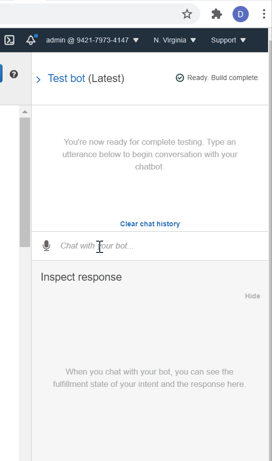
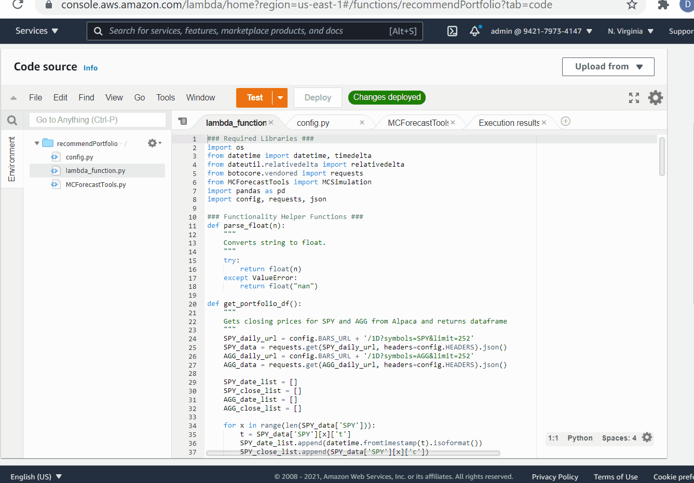

# AWS_Lex_Homework13

## Option 1: Robo Advisor for Retirement Plans

### Background
For this homework assignment, I created a bot that will recommend an investment portfolio for a retirement plan based on risk tolerance given by the user (low/med/high).

My AWS LexBot executes the following main tasks:

1. **[Initial Robo Advisor Configuration:](#Initial-Robo-Advisor-Configuration)** Define an Amazon Lex bot with a single intent that establishes a conversation about the requirements to suggest an investment portfolio for retirement.

2. **[Build and Test the Robo Advisor](#Build-and-Test-the-Robo-Advisor):** Make sure that your bot is working and responding accurately along with the conversation with the user, by building and testing it.

3. **[Enhance the Robo Advisor with an Amazon Lambda Function:](#Enhance-the-Robo-Advisor-with-an-Amazon-Lambda-Function)** Create an Amazon Lambda function that validates the user's input and returns the investment portfolio recommendation. This task includes testing the Amazon Lambda function and making the integration with the bot.

---
#### Build and Test the Robo Advisor\

#### AWS Lambda files & test script

